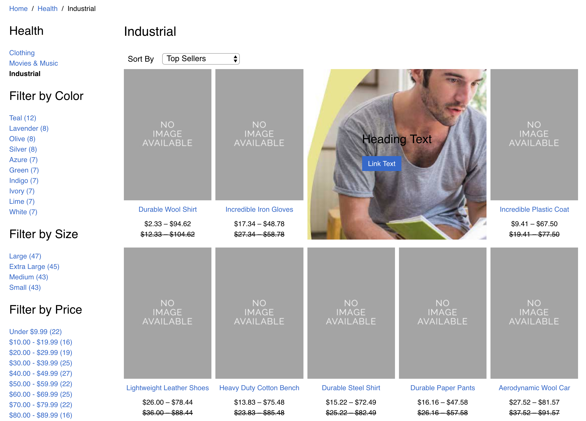

Workarea Product Grid Content
================================================================================

Product Grid Content plugin for the Workarea platform.

Extend the merchandising abilities of the Workarea Ecommerce platform with content in product browse grids!

Example of a 2x1 content block in the browse grid:

Platform Compatibility
--------------------------------------------------------------------------------

This plugin is best used with Workarea v3.3.0 and up.

Applications running > v3.0.27, > v3.1.13, > v3.2.2 or higher can use this plugin but require a few small changes to their host application view files.

1. Update the iterator in `storefront/categories/show.html.haml` to

    `@category.products.each_with_index do |product, position|`

2. Within the iterator add the following render statement

    `= render 'workarea/storefront/shared/product_grid_content_cell', model: @category, position: position`

3. Add the same render statement to the equivalent iterator in storefront searches/show.html.haml

Block Type Grid Options
--------------------------------------------------------------------------------

* **Position:** An integer input that allows the admin to choose the position of content within the grid.
* **Height & Width:** Allows admin to create 1x1, 1x2, 2x1, and 2x2 content blocks.
* **Height - floating tall blocks:** When the height of a block is greater than 1 cell it must be floated either left or right. This avoids breaking the grid and looks good at all viewport widths. By default, a block that is 2 cells in height will automatically float left, even if the float select menu is set to none. The float select menu can be used to override this behavior and float the content to the right.
* **Float:** Aside from 2 cell tall blocks it is unlikely that your admin will need to use this option.

Configuring Cell Width Classes
--------------------------------------------------------------------------------

Since most applications customize the number of products per-row in the product browse grid we have provided a handy configuration for cell widths for in grid content blocks. Add the following to your host application workarea.rb

    Workarea.configure do |config|
        config.product_grid_cell_classes = {
            "1": "grid__cell--50 grid__cell--25-at-medium grid__cell--20-at-wide",
            "2": "grid__cell--50-at-medium grid__cell--40-at-wide"
        }
    end

Content Block Compatibility
--------------------------------------------------------------------------------

The content block which ships with this plugin is the only block type that can be used in the product grid area out of the box.
If you want to enable other block types for use in the product grid you will need to make the following changes to each block type:

1. Add the 'Grid' fieldset to your block - you can copy and paste from the content block type defined in this plugin.
2. Include the GridContent module in your content block's view model.
3. Add the data binding for match_product_summary_height to your view
4. Test the block type in a grid position, you may need to adjust styles and markup to fit your design at this point.

Contentable Grids
--------------------------------------------------------------------------------

This plugin enables in-grid content for category/show and searches/show.
If your application has another browse grid which you want to make contentable you will need to:

1. Ensure your model is contentable
2. Include Storefront::ProductGridContent in the view model
3. Update the view to render content blocks as part of the loop over products. You may need to update your .each to .each_with_index as the index is necessary to render blocks for a given position.

Roadmap
--------------------------------------------------------------------------------

* Figure out a solution for 'hanging products' which are caused by the presence
    of content in the browse grid. The only workaround currently is to add significant
    content to the page, forcing a full row of hanging products.
    * Note that when using finite scroll pagination these hanging products are less
    noticeable, gaps are filled when the next page of products is appended.
* More controls for images in the block type (cropping/resizing)
* Positioning the content in the context of the content editor is a bit cumbersome,
    currently I cant think of a better solution which does not pose huge technical challenges.
    Ideally, we could edit the position of the blocks in a nice drag and drop interface.

Getting Started
--------------------------------------------------------------------------------

This gem contains a rails engine that must be mounted onto a host Rails application.

To access Workarea gems and source code, you must be an employee of WebLinc or a licensed retailer or partner.

Workarea gems are hosted privately at [https://gems.weblinc.com](https://gems.weblinc.com).
You must have individual or team credentials to install gems from this server. Add your gems server credentials to Bundler:

    bundle config gems.weblinc.com my_username:my_password

Or set the appropriate environment variable in a shell startup file:

    export BUNDLE_GEMS__WEBLINC__COM='my_username:my_password'

Then add the gem to your application's Gemfile specifying the source:

    # ...
    gem 'workarea-product_grid_content', source: 'https://gems.weblinc.com'
    # ...

Or use a source block:

    # ...
    source 'https://gems.weblinc.com' do
      gem 'workarea-product_grid_content'
    end
    # ...

Update your application's bundle.

    cd path/to/application
    bundle

Workarea Platform Documentation
--------------------------------------------------------------------------------

See [http://developer.weblinc.com](http://developer.weblinc.com) for Workarea platform documentation.

Copyright & Licensing
--------------------------------------------------------------------------------

Copyright WebLinc 2018. All rights reserved.

For licensing, contact sales@workarea.com.
